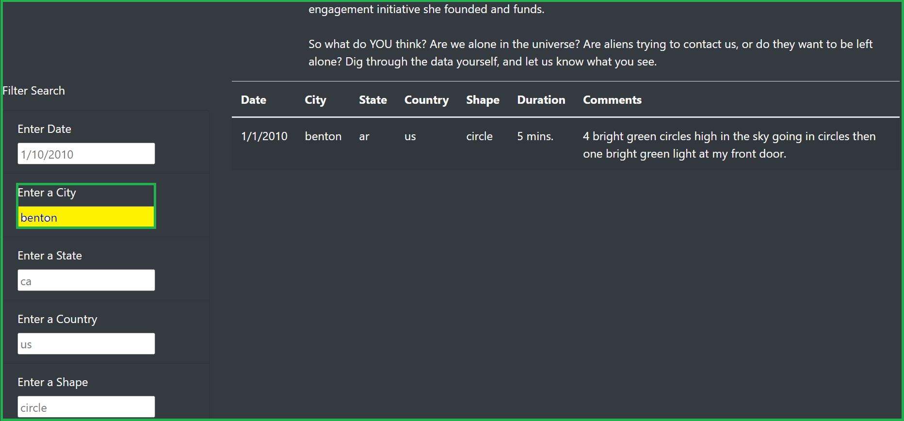
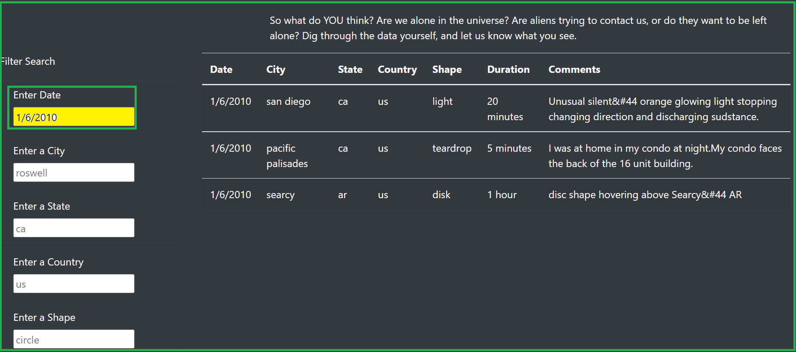
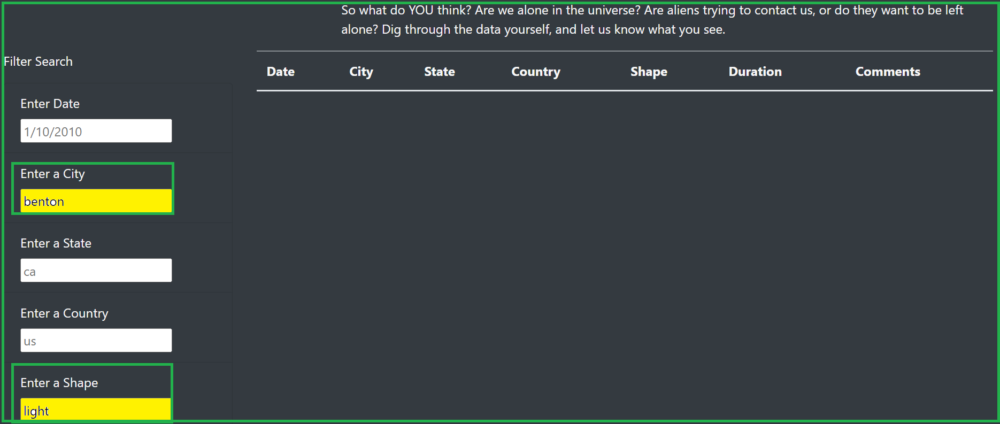
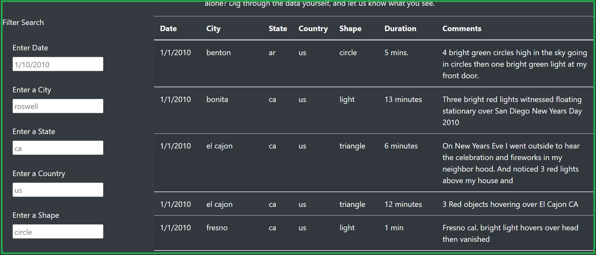

# UFOs

## Overview
In this project, we are working with UFO Sightings data using Javascript. Javascript (JS) is an interpreted
scripting language primarily used on web. It is used to enhance static HTML pages and is commonly found
embedded in HTML code using the <script \> tags.

### Purpose
The main purpose of this project is to provide a more in-depth analysis of UFO sightings by allowing the user
to filter the results based on multiple filters such as date, city, state, country and shape at the same time.
This makes the data easily to grasp and analyze for any user.

## Results

In order to make a filter/search on the web page, we need to make use of the text boxes on the left side of 
the UFO sightings table as follows:

- In order to make a search on specific date, city, state, country or shape we just need to enter the search
keyword exactly in the same format as we expect it to be present in the table. For example:
    - If we want to filter the results based on city `benton`, we need to type `benton` in the search box.

    

    - If we want to filter the results based on the date then we need to enter the date in the format as can
    be seen in the `date` text box which is `mm/dd/yyyy`

    

- In order to make a search with multiple filters at the same time, we need to enter specific search
keywords in their respective text boxes. For example:
    - If we want to filter the search on city `benton` and shape `light` then we need to enter `benton` in
the city text box and `light` in the shape text box. In case no results match on the criteria, nothing
is displayed in the table.

    

- In order to clear any filter, we just need to clear the criteria from the respective text boxes. If nothing
is specified in any text box, then we display the entire table.

    

## Summary

### Drawbacks and recommendations
- One common feature an user might want in the search algorithm is that it should be allowed to enter partial
keywords and the search should be able to return back the results that `includes` that keyword.

- Another related drawback is that we should be able to allow the user to enter a range of dates or multiple dates
in the date textbox, which should also accept all date formats so that we can make range queries. An equivalent workaround
that the user needs to do today in the web page is collate data with respect to multiple dates manually.

- The user also may want to see a summary of the table results which might be more attractive for the user.

- Also search text should not be case sensitive, which means text entered in lower case or upper case should 
display the result if matches.
